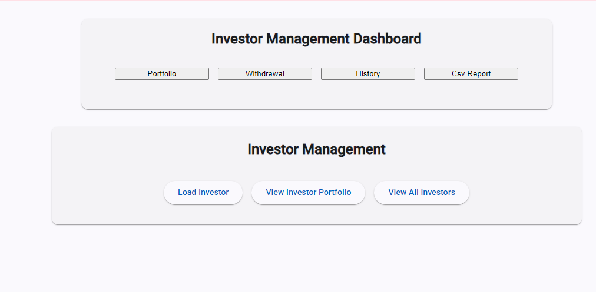
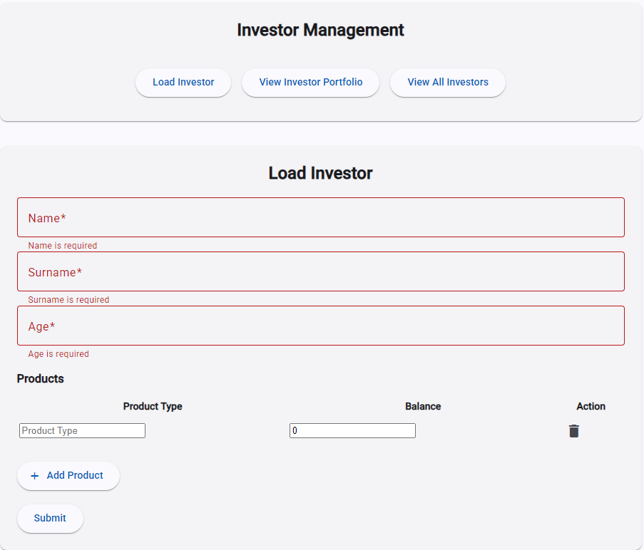
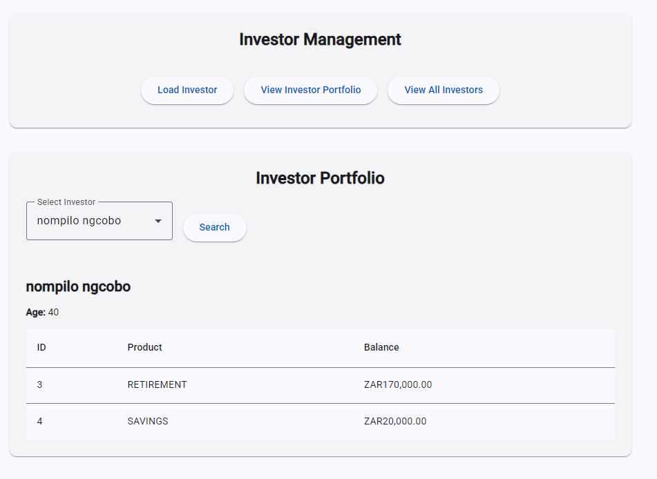
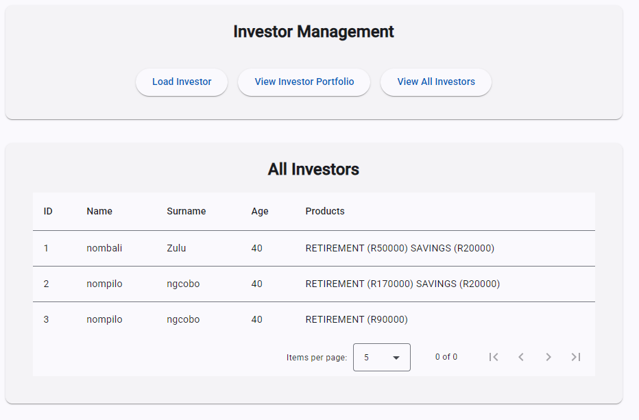
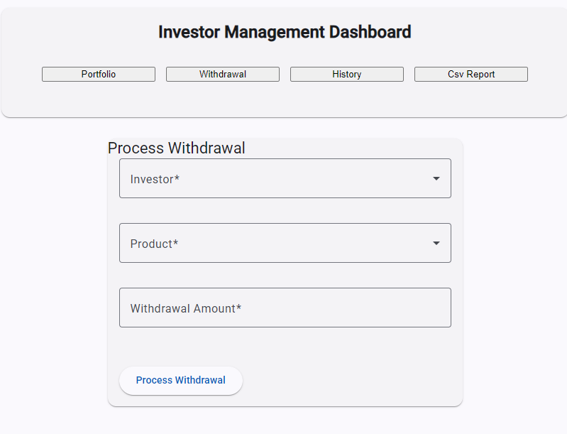
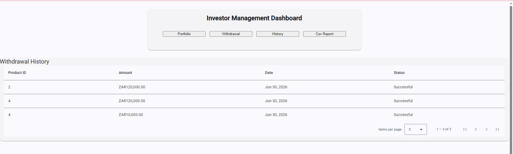
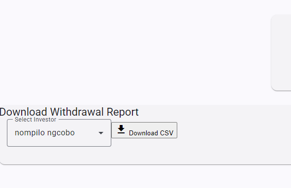

# Enviro365 Investments Frontend

An Angular web application for Enviro365 Investments that allows investors to manage portfolios, process withdrawals, and generate withdrawal reports.

## Features

### Investor Management
- **Load Investor** — register a new investor with one or more investment products
- **View Investor Portfolio** — search and view an investor's full portfolio including product balances
- **View All Investors** — paginated table listing all registered investors

### Withdrawal
- Process withdrawal requests for a selected investor and product
- Enforces business rules at the UI level (required fields, valid amounts)

### History
- Paginated table displaying full withdrawal history with product, amount, date, and status

### CSV Report
- Select an investor from a dropdown and download their withdrawal statement as a CSV file

## Tech Stack
- Angular
- Angular Material (mat-card, mat-table, mat-select, mat-form-field, mat-paginator)
- TypeScript
- Reactive Forms with validation
- RxJS

## Validation
- Required field validation on all forms
- Dropdown selection by investor ID to avoid ambiguity from duplicate names

## Setup
1. Clone the repository
2. Run `npm install`
3. Ensure the backend is running on `http://localhost:8080`
4. Run `ng serve`
5. Navigate to `http://localhost:4200`

## Screen shots

### Dashboard

### Load Investor

### View Portfolio

### All Investors

### Withdrawal

### Withdrawal History

### CSV Report

